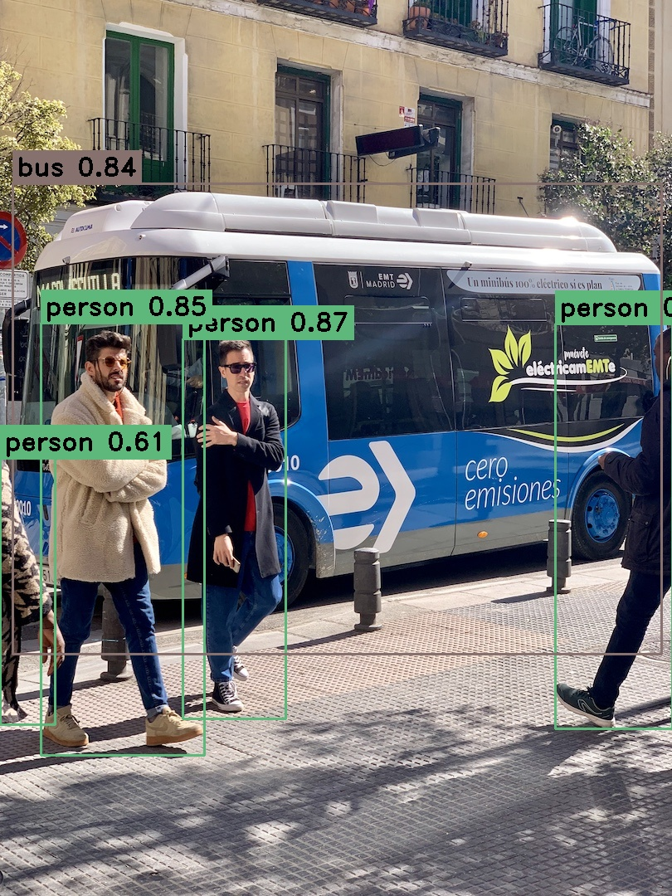
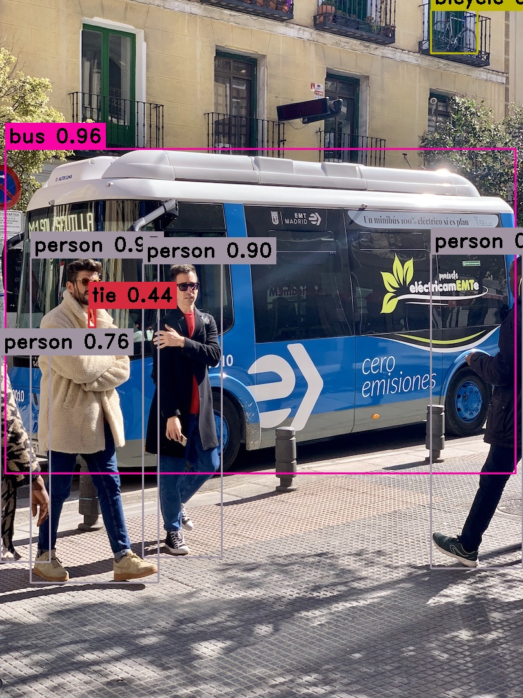
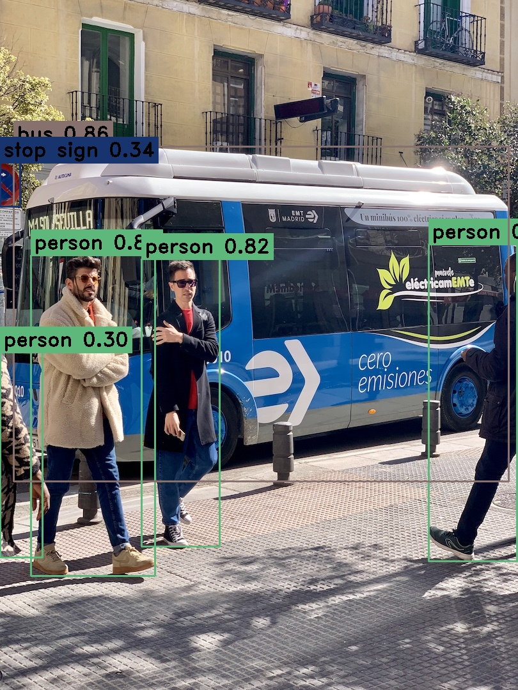

# yolo_dnn_inference
yolov5，yolov7和yolov8的opencv::dnn推理，代码参考yolov8提供的inference代码。  
## 编译opencv的gpu版本
yolov8需要opencv4.7.0以上，编译opencv的流程见博客https://www.cnblogs.com/Fish0403/p/16728393.html  
## 模型转换
链接：https://pan.baidu.com/s/13pWEZtA628U_89bzdDrwgg   
提取码：osit  
yolov5代码：https://github.com/ultralytics/yolov5 （使用的是7.0版本，较老的yolov5会有三个输出类似于yolov7）  
yolov7代码：https://github.com/WongKinYiu/yolov7  
yolov8代码：https://github.com/ultralytics/ultralytics  
### 效果展示
官方提供的pt模型推理效果  
  
dnn推理onnx效果  

